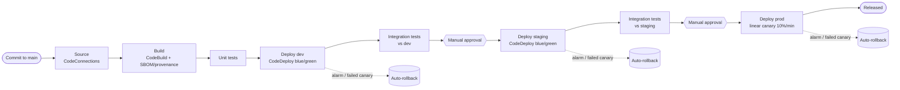
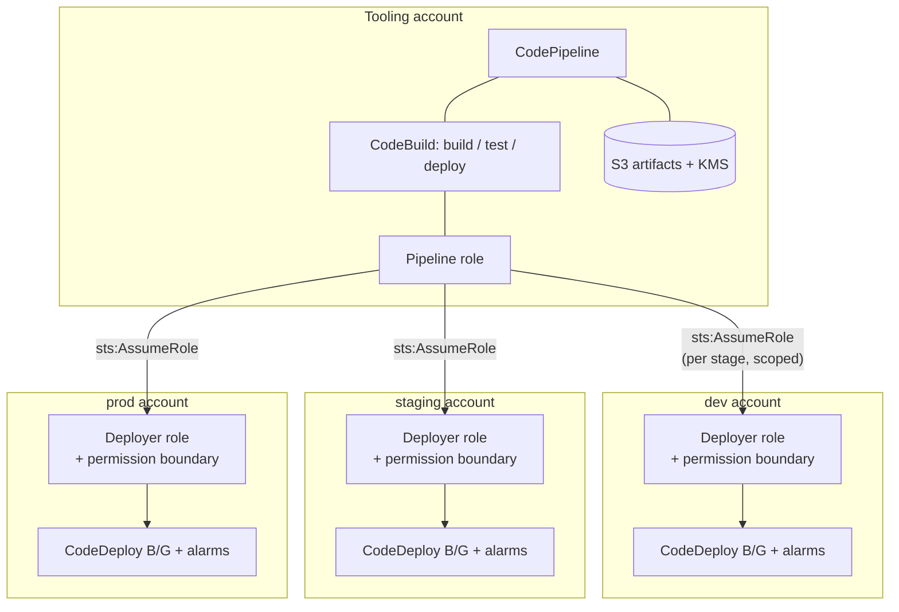

# aws-multi-account-cicd

[](https://github.com/shivajichaprana/aws-multi-account-cicd/actions/workflows/ci.yml)
[](LICENSE)
[](https://www.terraform.io/)

Multi-account CI/CD on AWS: a centrally-managed AWS CodePipeline that lives in a
dedicated **tooling account** and deploys into separate **dev / staging / prod
target accounts** by assuming least-privilege, permission-boundary-bounded
deployer roles. Deployments to ECS use CodeDeploy **blue/green** with a linear
canary strategy and CloudWatch-alarm-driven **automatic rollback**.

This repository is infrastructure-as-code (Terraform) plus the pipeline
definitions (buildspecs / appspec) and operator scripts that wire it together.

## Pipeline at a glance

A commit on the source branch triggers a single promotion path. Each stage
deploys under freshly-assumed, account-scoped credentials; promotion to
staging and prod is gated on a manual approval, and a failed post-deploy
validation or CloudWatch alarm rolls the stage back to the previous task set.



The promotion path is data-driven: the `deployment_stages` variable in the
tooling module declares each environment, whether it needs a manual approval,
and whether an integration-test action runs after its deploy. The default is
`dev` (auto) → `staging` (approval) → `prod` (approval).

## Account topology



### Why a separate tooling account?

Concentrating the pipeline, artifact store, and signing material in one tooling
account keeps the blast radius of the CI/CD system away from the workloads it
deploys. Target accounts trust the tooling account's pipeline role to assume a
single, tightly-scoped deployer role — nothing in a target account holds
standing credentials for the pipeline, and the pipeline never holds standing
credentials in a target account.

## Repository layout

| Path | Purpose |
|------|---------|
| `terraform/tooling-account/` | Root module applied in the tooling account: pipeline role, CodePipeline, CodeBuild, artifact bucket + KMS, notifications. |
| `terraform/target-account/`  | Root module applied in **each** target account: deployer role, permission boundary, CodeDeploy, deployment alarms, auto-rollback. |
| `pipelines/`                 | `buildspec-*.yml`, `appspec.yml`, and `generate-provenance.sh` consumed by CodeBuild / CodeDeploy. |
| `scripts/`                   | Operator helper scripts (canary validation, rollback drills). |
| `docs/`                      | [Architecture](docs/architecture.md) and [onboarding a new service](docs/onboarding-new-service.md). |
| `.github/workflows/`         | Repository CI (fmt / validate / yaml + shell lint). |

## Prerequisites

- Terraform >= 1.6, AWS provider >= 5.40
- An AWS Organizations setup with a tooling account and at least one target
  account (dev / staging / prod)
- A CodeConnections (formerly CodeStar Connections) connection to your Git
  provider, authorized to **Available** in the console
- Credentials for each account (the two root modules are applied with different
  account credentials / provider profiles)

## Quickstart

> Apply **target accounts first**, then the tooling account. The deployer role
> trusts the pipeline role *by ARN*, which does not require the pipeline role to
> exist yet; the pipeline role's `sts:AssumeRole` is then scoped to exactly the
> deployer role ARNs that now exist.

```bash
git clone https://github.com/shivajichaprana/aws-multi-account-cicd.git
cd aws-multi-account-cicd

# 1) In EACH target account (dev / staging / prod), with that account's creds:
cd terraform/target-account
cp terraform.tfvars.example terraform.tfvars   # set environment + tooling_account_id
terraform init && terraform apply

# 2) Then in the tooling account, with the tooling account's creds:
cd ../tooling-account
cp terraform.tfvars.example terraform.tfvars   # set target_accounts + source_* values
terraform init && terraform apply
```

Repo-local checks before you push are wrapped in the [`Makefile`](Makefile):

```bash
make fmt        # terraform fmt across both modules
make validate   # backend-less init + validate across both modules
make lint       # yamllint + shellcheck (matches CI)
make check      # fmt-check + validate + lint (the full local gate)
```

> Never commit a real `terraform.tfvars`; only the `*.example` files are
> tracked. Account ids in the examples are AWS documentation placeholders.

## Deployment safety model

- **Blue/green on ECS.** A green task set is created alongside blue; a *test*
  listener (8443) points at green so `scripts/canary-validator.sh` can probe it
  before any user traffic shifts. See `pipelines/appspec.yml` for the lifecycle
  hooks.
- **Linear canary to prod.** Prod traffic shifts 10% per minute, so a bad build
  is caught while most users are still on blue.
- **Alarm-driven auto-rollback.** Deployment-group alarms (5xx rate, latency,
  unhealthy hosts) abort an in-flight deployment and restore the blue task set.
  `scripts/test-rollback.sh` exercises this end-to-end against a target account.
- **Supply-chain provenance.** `pipelines/generate-provenance.sh` emits an
  in-toto SLSA Provenance v1.0 statement per artifact from CodeBuild metadata.

## Security model in one line

The pipeline role can assume **only** the named deployer roles; each deployer
role can do **only** what its permission boundary allows, regardless of the
policies later attached to it.

## CI

Every push and pull request runs [`.github/workflows/ci.yml`](.github/workflows/ci.yml):
`terraform fmt -check` + `validate` for both root modules, plus `yamllint` and
`shellcheck` over the pipeline specs and operator scripts. The workflow is
read-only and needs no AWS credentials, so it is safe on fork PRs.

## Documentation

- [docs/architecture.md](docs/architecture.md) — design decisions, account
  topology, deploy/rollback flow, and the threat model.
- [docs/onboarding-new-service.md](docs/onboarding-new-service.md) — connect a
  new service repository to the pipeline, step by step.
- [CONTRIBUTING.md](CONTRIBUTING.md) — local checks and commit conventions.

## Contributing

See [CONTRIBUTING.md](CONTRIBUTING.md). Security issues should be reported
through a private GitHub Security Advisory rather than a public issue:
https://github.com/shivajichaprana/aws-multi-account-cicd/security/advisories/new

## License

[MIT](LICENSE).
